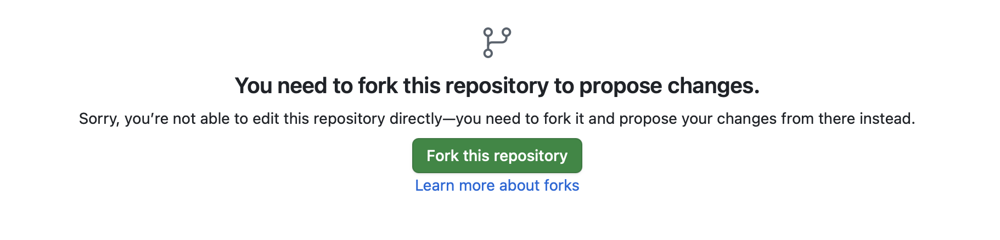

# Phase Field Method Recommended Practices

While the phase-field method is a powerful tool for modeling microstructure evolution, the value gained by its use depends on how it is used. The PFHub community has compiled a set of **Recommended Practices** that help to ensure the best outcomes from your use of the phase-field method.

These recommended practices have been broken down into several categories in the first part of the website.


```{tableofcontents}
```

The second part of the website a small sample book to give you a feel for how book content is
structured.
It shows off a few of the major file types, as well as some sample content.
It does not go in-depth into any particular topic - check out [the Jupyter Book documentation](https://jupyterbook.org) for more information.

# How to Propose Changes

If you don't want to work on the website locally, you can make all the edits using the GitHub website directly (see below for a video walkthrough).

1. Create a [GitHub](https://github.com) account (if you don't have one already).
1. Navigate to the project's GitHub repository by either following this [link](https://github.com/usnistgov/pf-recommended-practices) or through the GitHub icon at the top right section of each page. 
1. Navigate into the `pf-recommended-practices` folder, and then the `bp-guide-gh` folder.
1. Open the Markdown file you want to edit (optionally, check out the default pages available in this website for formatting features and guidelines).
1. Click on the edit button at the top right corner of the file. You may be prompted to first fork the repository if this is your first edit.

1. Make necessary changes and click on the green "Commit Changes" button.
1. Add any comments (optional), and proceed to create a "Pull Request".

The changes you propose will not take effect immediately. The request will be approved by the admins of the website, after which the changes will take effect.

<iframe width="560" height="315" src="https://www.youtube.com/embed/56v_kr1kKrY?si=gd9BjzVr3OnAJifj" title="YouTube video player" frameborder="0" allow="accelerometer; autoplay; clipboard-write; encrypted-media; gyroscope; picture-in-picture; web-share" referrerpolicy="strict-origin-when-cross-origin" allowfullscreen></iframe>
